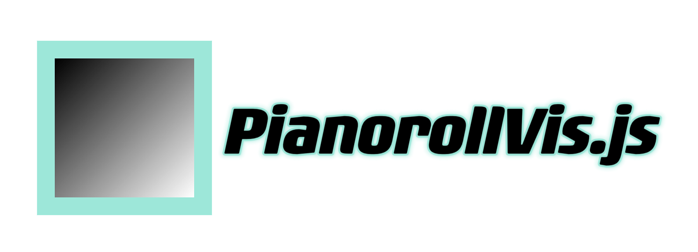

# PianorollVis.js 🎹🖥️

<div align="center">
  
</div>

PianorollVis.js is a JS library with simple API that visualize MIDI notes in pianoroll.
This library is built for the frontend visualization of symbolic music interaction.

<div align="center">
  
</div>

## Example demo

- [Horizontal keyboard, waterfall animation](https://lukewys.github.io/PianorollVis.js/examples/horizontal-waterfall.html)
- [Horizontal keyboard, sequencer animation](https://lukewys.github.io/PianorollVis.js/examples/horizontal-sequencer.html)
- [Vertical keyboard, waterfall animation](https://lukewys.github.io/PianorollVis.js/examples/vertical-waterfall.html)
- [Vertical keyboard, sequencer animation](https://lukewys.github.io/PianorollVis.js/examples/vertical-sequencer.html)
- [Minimal implementation](https://lukewys.github.io/PianorollVis.js/examples/minimal_example.html)

The first four examples supports both mouse and MIDI keyboard input.

For the source code, please see [examples](./examples).

## Usage

The core of this library is [note_visualization.js](./note_visualization.js).
To use the library, first import the script:

```html

<script src="note_visualization.js"></script>
```

You can also import from https://lukewys.github.io/PianorollVis.js/note_visualization.js .

Then, create a `NoteVisual` class that holds a panel of pianoroll for visualization:

```javascript
// the div to draw the piano roll
let div = document.getElementById('pianoroll');
// set the animation type and orientation
let animationType = 'waterfall';
let orientation = 'vertical';
// the number of octaves to draw. -1 means draw all 7 octaves
let numOctaves = -1;
// The lowest C on the piano roll. The number can be set from 1-7.
let lowestC = 1;
// set the width and height of the pianoroll.
// -1 means the height of the window
let width = -1;
let height = -1;
// the x,y position of the left top corner of visual panel
let x = 0;
let y = 0;

// create a new NoteVisual object for drawing
const visual = new NoteVisual(div, animationType, orientation,
    numOctaves, lowestC, width, height, x, y);
```

Last, create a draw loop class that handles the animation.
Using a separate draw loop class is useful for handling multiple animations at the same time.

```javascript
// create a new DrawLoop object for animation
const drawLoop = new DrawLoop(CONSTANTS.REFRESH_RATE);
// add the draw function to the draw loop
drawLoop.addDrawFunctionFromVisual(visual);
// start the draw loop
drawLoop.startDrawLoop();
```

Voilà! You should see a pianoroll panel in your browser.

Now you can add notes to the pianoroll by calling the `noteon` function,
and stop the note by calling the `noteoff` function.
Or, as we show below, you can call the function in the callback of your MIDI keyboard,
thus visualizing the notes you play on the keyboard:

```javascript
function onEnabled() {
    // Use WebMidi library to get the MIDI input
    const mySynth = WebMidi.inputs[0];
    // display the note name and play the note
    mySynth.channels[1].addListener("noteon", e => {
        // for noteOn, just specify note number and color
        visual.noteOn(e.note.number, 'orange');
    });
    mySynth.channels[1].addListener("noteoff", e => {
        // for noteOff, similarly, specify note number and color
        visual.noteOff(e.note.number, 'orange');
    });
}
```

## Details

This library supports two piano layouts and two animation types:

### Piano layout

- `vertical`: the piano is drawn vertically, with the lowest C on the left.
- `horizontal`: the piano is drawn horizontally, with the lowest C on the bottom.

For both layouts, the number of octaves to draw and the lowest C on the left can be specified.
If the number of octaves is set to -1, the library will automatically choose the number of octaves to draw:
if the pixel for drawing the pianoroll is longer than 700, 7 octaves will be drawn, otherwise, 3 octaves will be drawn.
Only when the number of octaves is set to 7, a full 88-key piano keyboard will be drawn, including the A0 and C8 keys.

## Animation type

- `waterfall`: the notes are constantly moving toward the edge until they are out of the screen.
- `sequencer`: a playhead indicates the current position on the pianoroll panel and additional lines are drawn to
  indicate beats.
  The notes stay at the canvas once it is played, and the start and end position of notes displayed on panel is
  where the playhead locates at the note onset and offset. When the playhead reaches the end of the panel, all notes on
  the panel are cleared and the playhead starts moving from the keyboard again.

## Instrument Synthesis

The [Tonejs-Instruments.js](./Tonejs-Instruments.js) in this repository is for synthesizing instrument sampler based on
Tonejs.
The code we use here is adapted from https://github.com/nbrosowsky/tonejs-instruments.
We host the samples on the [GitHub page](https://github.com/lukewys/lukewys.github.io/tree/master/files/tonejs-samples),
so you can use the instrument sampler without downloading any additional files.
You are free to use other samplers.

## Acknowledgement

This project is developed by Yusong Wu and Yi Deng, with little experience in the field. We wholeheartedly welcome anyone to
provide issues, feedback, or any suggestions to enhance the project, as your support and insights will help improve both
the library and our learning process.

We would like to thank the support and feedback from Prof. Anna Huang,
Prof. Chris Donahue, Prof. Jeremy R. Cooperstock, Nithya Shikapur and Jiaju Ma.

We thank the following awsome libraries and projects for providing reference and inspiration for this project:

- [PianoGenie](https://piano-genie.glitch.me/)
- [Magenta.js](https://github.com/magenta/magenta-js)
- [Tone.js](https://tonejs.github.io/)
- [VexFlow](https://www.vexflow.com/)
- [tonejs-instruments](https://github.com/nbrosowsky/tonejs-instruments)
